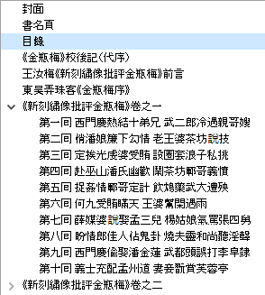
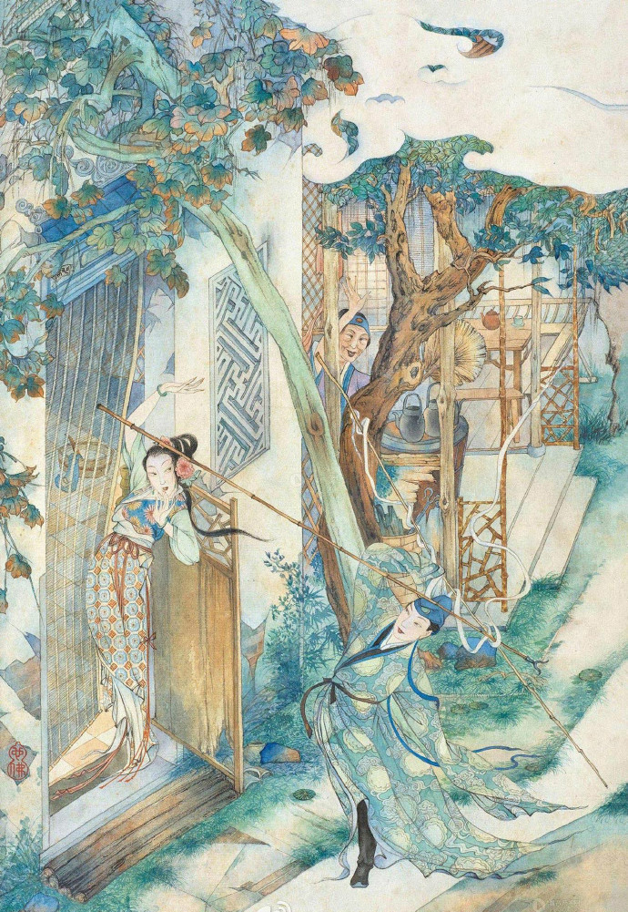
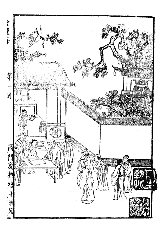

# 金瓶梅［崇祯版］ 
- 双版本，简体横版+繁体竖版
- 校对参考：[韩国梨花女子大学藏 皋鹤堂批评第一奇书.金瓶梅.十二册](https://new.shuge.org/meet/topic/34310/)
- 本latex在[此版本](http://static.latexstudio.net/wp-content/uploads/2013/03/JinPingMei_20120105.pdf)基础上编辑并校正其误。
- 如有报错、其它排版需求，请发新的issues.

## Table of Contents
- [横版、简体](#a5-32%E5%BC%80%E6%A8%AA%E7%89%88%E7%AE%80%E4%BD%93)
  - [预览图](##%E9%A2%84%E8%A7%88%E5%9B%BE)
- [豎版、繁體](#a5-32%E5%BC%80%E8%B1%8E%E7%89%88%E7%B9%81%E9%AB%94%E6%96%B0%E5%88%BB%E7%B9%A1%E5%83%8F%E6%89%B9%E8%A9%95%E7%89%88%E9%87%91%E7%93%B6%E6%A2%85)
  - [预览图](#%E9%A2%84%E8%A7%88%E5%9B%BE-1)
- [勘误](#%E5%8B%98%E8%AF%AF)

## A5 32开、横版、简体
- 畅读版
- 

### 预览图

| 目录 | 正文 |
|:---:|:---:|
| |  | 

## A5 32开、豎版、繁體——《新刻繡像批評版金瓶梅》
- [PDF 下载85M](https://drive.google.com/file/d/1a6QTWkqyuf60l7bOfnyEeCl2Hr1GRB78/view?usp=sharing)

### 预览图
| 目录 | 插图 | 回首图 | 正文 |
|:---:|:---:|:---:|:---:|
| |  |   |  | 

## 勘误
- 第八回：“且说**从**和尚” → “且说**众**和尚”
- 第十一回：“被**准**上一个客人” → “被**淮**上一个客人”
